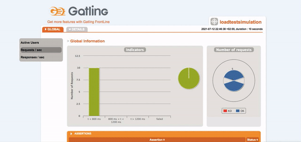

# Load tests sample task using Gatling

## How to start
As a first step please checkout project from GitHub repository available [here](https://github.com/annakapusciak/loadTestsTask).
To do that create some new folder on your local machine and depend on if you're using command console or not you can download project using this [link](https://github.com/annakapusciak/loadTestsTask/archive/refs/heads/main.zip) or in command line paste:
```
git clone https://github.com/annakapusciak/loadTestsTask.git
```

## Technology
- [Scala](https://www.scala-lang.org/) - as programming language
- [Gatling](https://gatling.io/) - powerful open-source load testing solution for continuous load testing

## Test scenario
The load test simulates 1000 users who will access the homepage within a set time frame of 15s. Measure web
application response time before and during the test run.

## Test case

Test is using few parameters which were predefined in [src/test/scala/simulations/PerfTestConfig](src/test/scala/simulations/PerfTestConfig.scala):
- `baseUrl` - home page of the application under the load test, default: https://computer-database.gatling.io
- `durationSeconds` - duration of load test (in seconds), default: 15 seconds
- `numberOfUsers` - number of user which access app within defined time frame, default: 1000 users
- `meanResponseTimeMs` - expected mean response time in milliseconds, default: 1000 ms
- `maxResponseTimeMs` - expected maximum response time in milliseconds, default: 2000 ms

Source code can be found in [src/test/scala/simulations/LoadTestSimulation.scala](src/test/scala/simulations/LoadTestSimulation.scala)

## Test execution
[maven](https://maven.apache.org/) needs to be installed on local machine.

 - To execute this test with default values please run maven command in terminal:
```
mvn clean gatling:test
```

> **Note:**
>
> Test with required predefined parameters is failing since service under the test is not meeting expected exit criteria like:
> - max of response time is less than 1000.0 ms
> - mean of response time is less than 2000.0 ms
> - percentage of successful events is greater than 95.0

- To execute this test with some custom parameters please run maven command in terminal and define available parameters:
```
mvn clean gatling:test -DbaseUrl=<url_to_test> -DdurationSeconds=<nbr_of_seconds> -DnumberOfUsers=<nbr_of_users> -DmeanResponseTimeMs=<time_in_ms> -DmaxResponseTimeMs=<time_in_ms>
```
Example:
```
mvn clean gatling:test -DbaseUrl=https://computer-database.gatling.io -DdurationSeconds=10 -DnumberOfUsers=5 -DmeanResponseTimeMs=1000 -DmaxResponseTimeMs=2000
```

## Test results / Report
After test run Gatling generates very detailed report which will be automatically created in `<your_local_folder_with_dowlnloaded_project>/target/gatling` folder.

- Sample Gating report
  
  

- Sample output in console for running test with parameters like:
```
mvn clean gatling:test -DbaseUrl=https://computer-database.gatling.io -DdurationSeconds=10 -DnumberOfUsers=5 -DmeanResponseTimeMs=1000 -DmaxResponseTimeMs=2000
```

Report:
```
Simulation simulations.LoadTestSimulation completed in 8 seconds
Parsing log file(s)...
Parsing log file(s) done
Generating reports...

================================================================================
---- Global Information --------------------------------------------------------
> request count                                         10 (OK=10     KO=0     )
> min response time                                    112 (OK=112    KO=-     )
> max response time                                    585 (OK=585    KO=-     )
> mean response time                                   326 (OK=326    KO=-     )
> std deviation                                        205 (OK=205    KO=-     )
> response time 50th percentile                        306 (OK=306    KO=-     )
> response time 75th percentile                        509 (OK=509    KO=-     )
> response time 95th percentile                        578 (OK=578    KO=-     )
> response time 99th percentile                        584 (OK=584    KO=-     )
> mean requests/sec                                  1.111 (OK=1.111  KO=-     )
---- Response Time Distribution ------------------------------------------------
> t < 800 ms                                            10 (100%)
> 800 ms < t < 1200 ms                                   0 (  0%)
> t > 1200 ms                                            0 (  0%)
> failed                                                 0 (  0%)
================================================================================

Reports generated in 0s.
Please open the following file: /Users/Ania/IdeaProjects/GatlingLoadTests/loadTestsTask/target/gatling/loadtestsimulation-20210712204638767/index.html
Global: max of response time is less than 1000.0 : true
Global: mean of response time is less than 2000.0 : true
Global: percentage of successful events is greater than 95.0 : true
[INFO] ------------------------------------------------------------------------
[INFO] BUILD SUCCESS
[INFO] ------------------------------------------------------------------------
[INFO] Total time:  33.178 s
[INFO] Finished at: 2021-07-12T22:46:50+02:00
[INFO] ------------------------------------------------------------------------
```

## Findings
- executed test with default parameters have an impact to the tested app. It can be observed based on a lot of 429 (Too many requests) HTTP response.
- optimal application response should be up to one-second, it is generally the maximum acceptable limit, as users still likely won’t notice a delay. Anything more than one second might be problematic because then users can leave the website or application entirely.
- we can relay as well on some benchmarks like [https://www.littledata.io/average/server-response-time](https://www.littledata.io/average/server-response-time) which gather actual statistics of sites response time